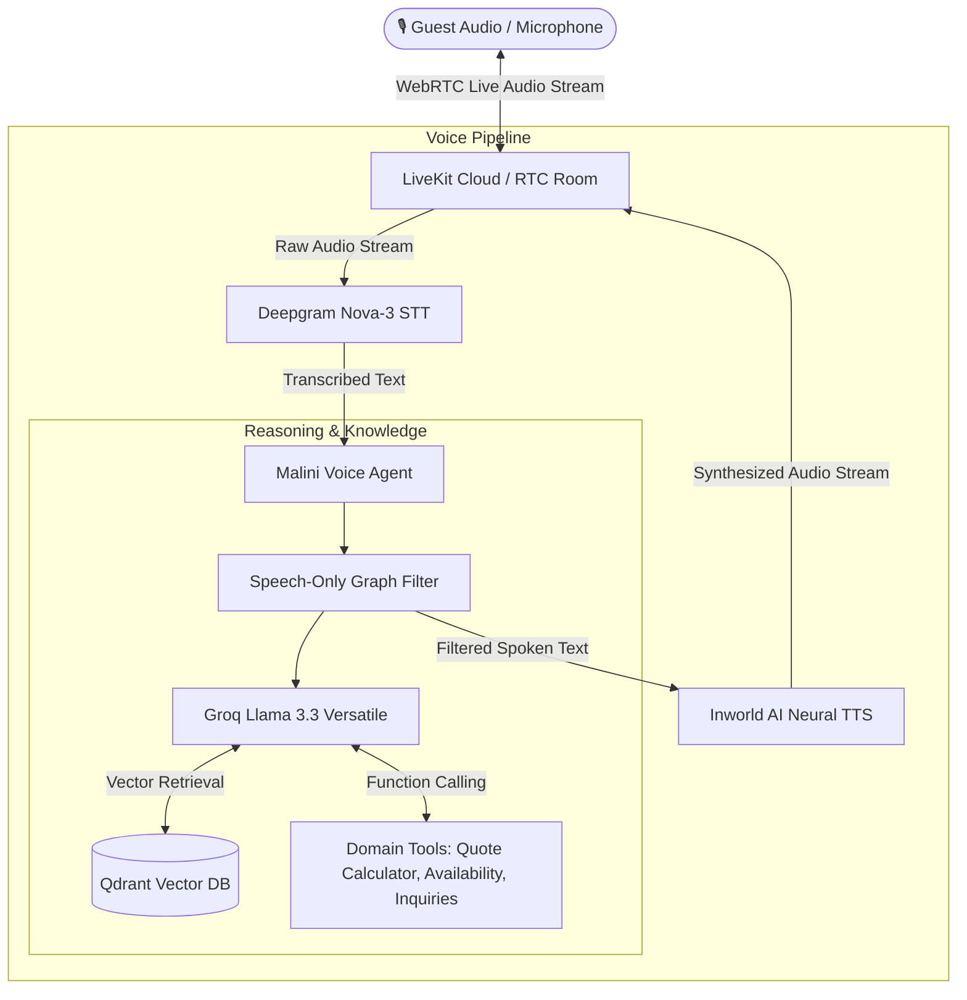

# 🎙️ Malini Voice — Real-Time Voice Concierge & Booking Assistant

<p align="center">
  
  
  
  
  
  
  
  
</p>

<p align="center">
  <strong>An autonomous, ultra-low-latency real-time voice concierge designed for Malini Homes — a government-registered homestay brand in Guwahati, Assam.</strong>
</p>

---

## 📑 Table of Contents

- [🌟 Overview](#-overview)
- [✨ Key Highlights & Capabilities](#-key-highlights--capabilities)
- [🏛️ System Architecture](#️-system-architecture)
- [🏡 The Homestay Properties](#-the-homestay-properties)
- [🛠️ Tech Stack & Engineering Innovations](#️-tech-stack--engineering-innovations)
- [🗣️ Conversational Voice Examples](#️-conversational-voice-examples)
- [🚀 Quick Start Guide](#-quick-start-guide)
  - [Prerequisites](#prerequisites)
  - [Installation & Setup](#installation--setup)
  - [Ingesting the Knowledge Base](#ingesting-the-knowledge-base)
  - [Running the Agent](#running-the-agent)
- [📁 Project Structure](#-project-structure)
- [🔒 Security & Best Practices](#-security--best-practices)
- [👩‍💻 Author & Connect](#-author--connect)

---

## 🌟 Overview

Planning homestay visits in Assam should feel as warm and seamless as Assamese hospitality itself. However, homestay hosts frequently face repetitive guest inquiries:
- Room pricing across multiple configurations (private rooms vs. full 2BHKs).
- Pet policies, kitchen availability, and parking accommodations.
- Distance and transit guidance to iconic Guwahati landmarks (Kamakhya Temple, Brahmaputra River Cruises, Sualkuchi, Pobitora).
- Reservation requests and urgent human host escalations.

**Malini Voice** solves this by delivering an end-to-end, ultra-low-latency voice experience. Guests speak naturally over a WebRTC audio channel and receive instant, warm, grounded spoken responses.

---

## ✨ Key Highlights & Capabilities

- ⚡ **Sub-Second Voice Streaming**: Powered by LiveKit Agents over WebRTC, providing immediate conversational turn-taking without awkward delays.
- 🎯 **Hallucination-Free RAG**: Indexes verified property documentation, policies, and tourism itineraries using **Docling** and **Qdrant** vector search.
- 🧮 **Accurate Stay Quotes (₹)**: Built-in calculation engine dynamically computes quotes in Indian Rupees based on property unit, nights, and guest headcount.
- 🎫 **Automated Inquiry Logging**: Collects guest names, dates, and contact details to generate unique reservation inquiry tickets (`MALINI-XXXXX`).
- 🤝 **Human Host Escalation**: Smoothly escalates complex booking requests directly to human hosts via WhatsApp or direct phone contact (`+91 8011110315`).
- 🌺 **Cultural Warmth**: Embeds genuine Assamese hospitality (*"Atithi Devo Bhava"*) and deep local city knowledge.

---

## 🏛️ System Architecture



---

## 🏡 The Homestay Properties

Malini Voice natively manages and represents all three official properties of Malini Homes:

| Property | Location Type | Key Features | Rates (INR) | Host Contact |
|---|---|---|---|---|
| **Unit 1: Silpukhuri** | Central City Hub *(Nirupama Bhawan, Krishna Nagar)* | Full 2BHK, Hummingbird Magic Room, Butterfly Effect Room. Balcony, Smart TV, kitchen. | ₹1,800/room<br>₹3,500 full 2BHK | `+91 8011110315` |
| **Unit 2: Zoo Road** | Upscale Urban Retreat *(Near R.G. Baruah Road)* | Full 2BHK, Serene Deluxe, Serene Delight. Walkable to cafes, shopping, and Assam State Zoo. | ₹2,000/room<br>₹4,000 full 2BHK | `+91 8011110315` |
| **Unit 3: Bhangagarh** | Healing Sanctuary & Medical Hub *(Near GMCH)* | Patient-friendly, elevator access, pet-friendly, home-cooked traditional Assamese thalis. | ₹1,600/room<br>₹3,200 full unit | `+91 8011110315` |

---

## 🛠️ Tech Stack & Engineering Innovations

### 1. LiveKit Agents Framework (WebRTC)
Utilizes the event-driven `livekit-agents` pipeline to manage real-time audio streams, conversational endpointing (detecting when a speaker finishes talking), and interruption handling.

### 2. Speech-Only Token Filtering (`SpeechOnlyGraph`)
A common issue in voice agents using function calling is that internal tool responses (e.g., JSON schemas or raw Python dicts) leak into the text-to-speech engine. 
Malini Voice incorporates a custom **`SpeechOnlyGraph`** wrapper that intercepts the LangChain stream, discards intermediate tool tokens, and only streams synthesized conversational prose to the TTS synthesizer.

### 3. Grounded Retrieval (Docling + Qdrant)
Property PDF manuals are parsed and structured with **Docling**, embedded using `sentence-transformers` (`all-MiniLM-L6-v2`), and indexed into a local **Qdrant** vector store with rich semantic metadata.

### 4. High-Throughput Reasoning (Groq)
Powered by Groq's low-latency inference engine running **Llama 3.3 70B Versatile**, allowing instant tool selection and natural conversational responses.

---

## 🗣️ Conversational Voice Examples

| What You Say | What Malini Voice Does | How It Responds |
|---|---|---|
| *"Can you tell me about your homestays in Guwahati?"* | Retrieves multi-property overviews from Qdrant. | *"We welcome you to Malini Homes! We have three properties in Guwahati: Silpukhuri in the central hub, Zoo Road for an upscale retreat, and Bhangagarh near GMCH. Which location suits your trip best?"* |
| *"How much would the full 2BHK in Silpukhuri cost for 3 nights for 4 guests?"* | Invokes `calculate_stay_quote` tool with exact pricing logic. | *"For the full 2BHK at Silpukhuri across 3 nights for 4 guests, your total stay quote comes to ₹10,500. Would you like me to note down your booking details?"* |
| *"I'm visiting Guwahati for medical checkups with my dog. Any recommendations?"* | Performs RAG lookup over property policies. | *"Our Bhangagarh property is ideal for you! It is located right by GMCH, features lift access, offers home-cooked meals, and is pet-friendly."* |
| *"How far is Kamakhya Temple from Silpukhuri?"* | Retrieves travel distances and local transit advice. | *"Kamakhya Temple is approximately 8 km from our Silpukhuri unit. It typically takes around 25 to 30 minutes by taxi. We recommend visiting early morning to avoid the rush."* |
| *"Please book Silpukhuri for next weekend. My number is 9876543210."* | Executes `create_booking_inquiry` tool and logs ticket. | *"I've logged your reservation inquiry under ticket MALINI-84210! Our host will reach out to you on 9876543210 to confirm your dates."* |

---

## 🚀 Quick Start Guide

### Prerequisites
- Python `>= 3.12`
- Free or Cloud account on [LiveKit Cloud](https://livekit.io/)
- Free API key from [Groq Console](https://console.groq.com/keys)

### Installation & Setup

1. **Clone the repository:**
   ```bash
   git clone https://github.com/sandhya-bdb/malini-homes-voice-agent.git
   cd malini-homes-voice-agent
   ```

2. **Create and activate a virtual environment:**
   ```bash
   python3 -m venv .venv
   source .venv/bin/activate
   pip install -e .
   ```

3. **Configure Environment Variables:**
   Copy `.env.example` to `.env` and fill in your credentials:
   ```bash
   cp .env.example .env
   ```

   ```ini
   LIVEKIT_URL=wss://your-project.livekit.cloud
   LIVEKIT_API_KEY=your_livekit_api_key
   LIVEKIT_API_SECRET=your_livekit_api_secret
   GROQ_API_KEY=gsk_your_groq_api_key
   ```

### Ingesting the Knowledge Base
To compile the homestay documentation and index it into the local Qdrant vector database:

```bash
# 1. (Optional) Generate latest property PDFs
python generate_malini_pdfs.py

# 2. Ingest PDFs into Qdrant vector store
python ingest.py
```

### Running the Agent

You can run Malini Voice in three different modes:

#### Option A: Interactive Microphone Console Mode
Talk directly with the agent through your local microphone and speakers:
```bash
python -m voice_agent.main console
```

#### Option B: Text Console Mode
Test the voice pipeline in terminal using text input (without audio devices):
```bash
python -m voice_agent.main console --text
```

#### Option C: LiveKit Cloud Dev Mode (WebRTC Worker)
Connect the agent worker to your LiveKit Cloud project and interact via the [LiveKit Agents Playground](https://cloud.livekit.io/):
```bash
python -m voice_agent.main dev
```

#### Option D: Quick Non-Interactive Pipeline Test
Validate the LangChain graph, Groq inference, and Qdrant retrieval in one command:
```bash
python test_agent.py
```

---

## 📁 Project Structure

```text
malini-homes-voice-agent/
├── config.py                 # Central settings & pydantic configuration
├── generate_malini_pdfs.py   # Compiles official homestay specs into PDFs
├── ingest.py                 # Docling PDF parsing & Qdrant vector ingestion
├── test_agent.py             # Headless verification script for RAG & tools
├── pyproject.toml            # Project dependencies & build configuration
├── docs/                     # Source PDF documentation for RAG
│   ├── malini-properties-and-pricing.pdf
│   ├── malini-booking-policies-and-faq.pdf
│   └── malini-guwahati-guide-and-experiences.pdf
├── langchain_agent/          # Core reasoning & agentic engine
│   ├── __init__.py
│   ├── rag.py                # Semantic vector search & context builder
│   └── tools.py              # Domain tools (quotes, availability, ticketing)
└── voice_agent/              # LiveKit WebRTC audio pipeline
    ├── __init__.py
    └── main.py               # Deepgram STT + Inworld TTS + SpeechOnlyGraph
```

---

## 🔒 Security & Best Practices

- **Strict Secret Isolation**: `.env`, API credentials, and internal databases are protected by comprehensive `.gitignore` rules.
- **No Hallucinated Rates**: Critical pricing and reservation rules are governed by deterministic domain calculation tools rather than unbound LLM generation.
- **Graceful Escalation**: Direct failover to human operators for any out-of-scope or sensitive requests.

---

## 👩‍💻 Author & Connect

Developed by **Sandhya Banti Dutta Borah**  
*Building real-world AI agents, multi-modal voice interfaces, and intelligent systems.*

- 💼 **LinkedIn**: [Connect on LinkedIn](https://www.linkedin.com/in/sandhya-banti-dutta-borah)
- 🐙 **GitHub**: [@sandhya-bdb](https://github.com/sandhya-bdb)

---

<p align="center">
  <i>"Atithi Devo Bhava — Experience the warmth of Assam with Malini Voice."</i> 🦏☕🌸
</p>
